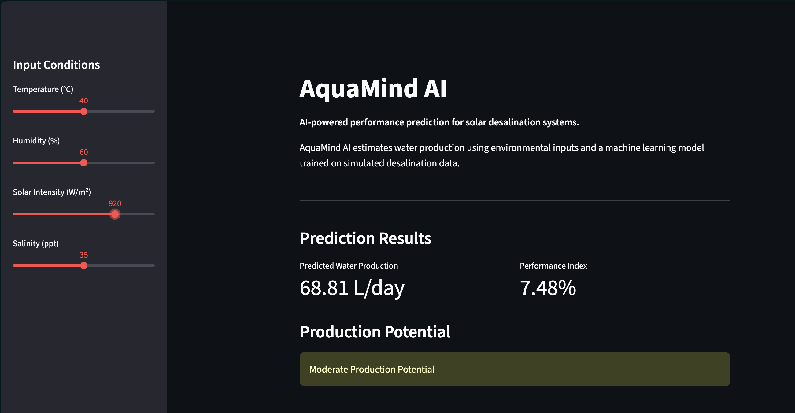
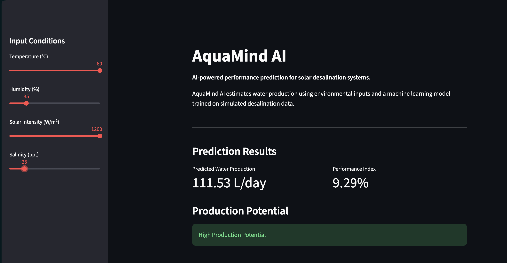
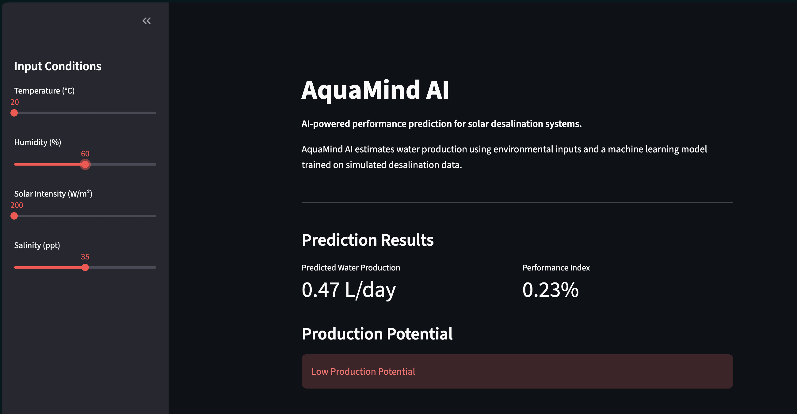

# 🌊 AquaMind AI

An AI-powered platform for predicting and analyzing the performance of solar desalination systems using machine learning.

<p align="center">
  
</p>

---

## Overview

AquaMind AI is an independent artificial intelligence and software engineering project that predicts the freshwater production of solar desalination systems based on environmental operating conditions.

The project combines machine learning, data analysis, and an interactive Streamlit dashboard to estimate system performance.

The long-term vision is to develop AquaMind AI into a decision-support and design optimization platform for multiple solar desalination technologies.

---

## Features

* Machine learning-based water production prediction
* Interactive Streamlit dashboard
* Environmental input controls
* Production Potential assessment
* Performance Index comparison
* Synthetic dataset generation
* Modular Python architecture

---

## Dashboard

### Moderate Production Potential

<p align="center">
  
</p>

### High Production Potential

<p align="center">
  
</p>

### Low Production Potential

<p align="center">
  
</p>

---

## Project Structure

```text
AquaMind-AI
│
├── app.py
├── data/
│   └── desalination_data.csv
│
├── docs/
│   ├── development_log.md
│   ├── project_plan.md
│   └── images/
│
├── reports/
│
├── src/
│   ├── data_analysis.py
│   ├── data_generator.py
│   ├── data_visualization.py
│   ├── interactive_predictor.py
│   ├── model.py
│   └── simulator.py
│
├── requirements.txt
└── README.md
```

---

## Technologies

* Python
* Streamlit
* Pandas
* NumPy
* Scikit-learn
* Matplotlib
* Git
* GitHub

---

## Installation

Clone the repository:

```bash
git clone https://github.com/YOUR_GITHUB_USERNAME/AquaMind-AI.git
cd AquaMind-AI
```

Create a virtual environment:

```bash
python3 -m venv .venv
```

Activate the virtual environment:

### macOS / Linux

```bash
source .venv/bin/activate
```

### Windows

```bash
.venv\Scripts\activate
```

Install the required packages:

```bash
pip install -r requirements.txt
```

Run the application:

```bash
streamlit run app.py
```

---

## Current Limitations

* The current dataset is synthetically generated for development and testing.
* The model currently considers environmental variables only.
* The Performance Index is a normalized comparison metric and is not a thermodynamic efficiency.
* Predictions are based on a Linear Regression model.

---

## Future Development

* Engineering design parameters
* Explainable AI (XAI)
* Design optimization
* Support for multiple solar desalination technologies
* Research-based datasets
* Advanced machine learning models
* Model uncertainty estimation
* Performance comparison between desalination technologies

---

## Documentation

Additional documentation is available in the `docs/` directory:

* Development Log
* Project Plan

---

## Author

**Abdulaziz Al-Marwani**

---

## License

This project is currently intended for educational and research purposes.
